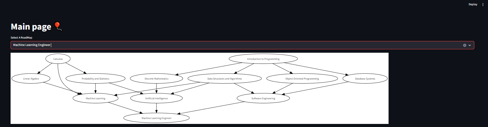

# Streamlit Data Visualization App

How to run the project

0. Clone this project
1. Install and setup python virtual environment with venv: https://docs.python.org/3/library/venv.html
2. Install dependencies: `pip install -r requirements.txt`
3. Run the streamlit app: `python -m streamlit run main.py`

Have Funn!

